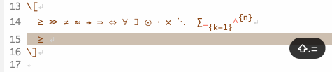

For LaTeX:

- Greek letters: using [cdlatex](https://github.com/cdominik/cdlatex)
  
  
- Intelligent fraction and subscripts: using [aas](https://github.com/ymarco/auto-activating-snippets) and
  [laas](https://github.com/tecosaur/LaTeX-auto-activating-snippets).

  
- Modifiers
  - automatically select the word under the cursor (or adjacent to it) if no
  region is activated
  - wrap the region with macros specified according to text or math environment
  - E.g., 

    

    

    ```yasnippet
    # -*- mode: snippet -*-
    # name: LaTeX bold
    # type: command
    # binding: s-b
    # --
    (yasp-selected-current)
    (yas-expand-snippet
    (if (region-active-p)
        (if (texmathp)
            "\\mathbf{`yas-selected-text`}$0"
            "\\textbf{`yas-selected-text`}$0"
        )
        (if (texmathp)
            "\\mathbf{$0}"
            "\\textbf{$0}"
        )
    )
    )
    ```
  - My implementation of fraction:
    
    
- Other snippets: E.g., 

    

Configurations:

- Install
  [https://github.com/ywangmy/yasupp.el](https://github.com/ywangmy/yasupp.el)
- Yasnippet

```emacs-lisp
;; YASnippet

(use-package yasupp
  :hook
  (yas-minor-mode . yasp-minor-mode)
  )

(use-package yasnippet
  :ensure t
  :init
  (yas-global-mode 1)
  :custom
  (yas-snippet-dirs '("~/.emacs.d/yasnippets"))
  (yas-prompt-functions '(yas-dropdown-prompt))
  (yas-wrap-around-region nil)
  (yas-triggers-in-field t)
  )

(provide 'init-yasnippet)
```

- LaTeX, cdlatex

```emacs-lisp
(use-package reftex
  :ensure t
  :config
  (setq reftex-plug-into-AUCTeX t)
  )

(use-package cdlatex
  :ensure t
  :config
  (setq cdlatex-takeover-parenthesis nil)
  (setq cdlatex-takeover-dollar nil)
  (setq cdlatex-paired-parens nil)
  :custom-face
  (font-latex-sectioning-5-face ((t (:inherit nil :foreground "dark green"))))
  :custom
  (cdlatex-use-dollar-to-ensure-math nil)
  (cdlatex-math-modify-prefix "C-`")
  (cdlatex-math-symbol-prefix ?`)
  (cdlatex-math-modify-alist '
   (;; Character Math Text t nil nil
    (?c "\\textcolor{red}" "\\textcolor{SeaGreen}" t nil nil)
    (?C "\\mathcal" "\\textsc" t nil nil)
    (?h "\\colorbox{SeaGreen}" "\\colorbox{SeaGreen}" t nil nil)
    (?H "\\colorboxd{SeaGreen}" "\\colorboxd{SeaGreen}" t nil nil)
    (?t "\\text" nil t nil nil)
    (?u "\\unit" "\\underline" t nil nil)
    (?z "\\zh" "\\zh" t nil nil)
    (?- "\\bar" "\\sout" t nil nil)
    (?\] "\\underbracket" nil t nil nil)
    )
   )
  :bind (:map cdlatex-mode-map
              ("<" . nil)
              )
  )

;; LaTeX-mode in latex.el
(use-package latex
  :mode ("\\.tex\\'" . LaTeX-mode)
  :hook ((LaTeX-mode . turn-on-cdlatex)   ; with AUCTeX LaTeX mode
         (LaTeX-mode . turn-on-reftex)
         (LaTeX-mode . prettify-symbols-mode)
         (LaTeX-mode . outline-minor-mode)
         (LaTeX-mode . turn-on-auto-fill)
         )
  :bind (:map LaTeX-mode-map
              ("<backtab>" . LaTeX-indent-line)
              ("C-c C-a" . (lambda () (interactive) (let (TeX-save-query) (TeX-save-document (TeX-master-file))) (TeX-command-run-all nil)))
              )
  :config
  ;; make AUCTeX aware of style files and multifile documents
  (setq TeX-auto-save t)
  (setq TeX-parse-self t)
  (setq-default TeX-master nil)
  ;; add-to-list only AFTER package loaded
  (mapc (lambda (pair) (push pair tex--prettify-symbols-alist))
        '(("\\item" . ?•)
          ("\\section" . ?§)
          ("\\subsection" . ?§)
          ("\\subsubsection" . ?§)
          ("\\begin" . ?⦃)
          ("\\end" . ?⦄)
          ("\\implies" . ?⇒)
          ("\\iff" . ?⇔)
          ("\\nrightarrow" . ?↛)
          ("\\nRightarrow" . ?⇏)
          ("\\dots" . ?…)
          ("\\cdots" . ?⋯)
          ("\\ddots" . ?⋱)
          ("\\vdots" . ?⋮)
          ("\\bot" . ?⟂)
          ("\\overline" . ?‾)
          ("\\pm" . ?±)
          ("\\mp" . ?∓)
          ("\\star" . ?★)
          )
        )
  (add-to-list 'LaTeX-verbatim-environments "lstlisting")
  (add-to-list 'LaTeX-verbatim-environments "lstinputlisting")
  (add-to-list 'LaTeX-verbatim-environments "lstinline")
  ;; escape indentation for verbatim
  (add-to-list 'LaTeX-indent-environment-list '("lstlisting" current-indentation))
  (add-to-list 'LaTeX-indent-environment-list '("lstinputlisting" current-indentation))
  (add-to-list 'LaTeX-indent-environment-list '("algorithm" current-indentation))
  (add-to-list 'LaTeX-indent-environment-list '("algorithmic" current-indentation))  
  (setq preview-scale-function
        (lambda () (* 0.75 (funcall (preview-scale-from-face)))))
  
  :custom
  (LaTeX-fill-excluded-macros '("hypersetup" "title" "author" "date"))
  (TeX-newline-function 'reindent-then-newline-and-indent)
  )
```

- aas, laas

```emacs-lisp
;; aas and laas
(use-package laas
  :ensure t
  :hook ((LaTeX-mode . laas-mode)
         (org-mode . laas-mode)
         )
  :init
  (setq laas-accent-snippets nil)
  (setq laas-basic-snippets nil)
  ;;(setq laas-subscript-snippets nil)
  :custom
  (laas-enable-auto-space nil)
  :config
  (aas-set-snippets 'laas-mode
    "ii" nil
    "ip1" nil
    "jj" nil
    "jp1" nil
    "kk" nil
    "kp1" nil
    "nn" nil
    "np1" nil
    )
  (aas-set-snippets 'laas-mode
    ;; operators
    :cond #'texmathp
    "n->" "\\nrightarrow "
    "n=>" "\\nRightarrow "
    ;; symbols
    :cond #'texmathp
    ;; Calculus
    "eva" (lambda () (interactive) (yas-expand-snippet "\\bigg\\rvert_{${1:a}}^{${2:b}}"))
    ;; functions & symbols
    :cond #'texmathp
    "inv" "^{-1}"
    "lisu" (lambda () (interactive) (yas-expand-snippet "\\limsup\\limits_{${1:n} \\to ${2:\\infty}} $0"))
    "liin" (lambda () (interactive) (yas-expand-snippet "\\liminf\\limits_{${1:n} \\to ${2:\\infty}} $0"))
    "oint" (lambda () (interactive) (yas-expand-snippet "\\oint_{${1:C}} $0"))
    "curl" "\\nabla\\times "
    "dive" "\\nabla\\cdot "
    "var" "\\sigma^2"
    ;; wrappers
    :cond #'texmathp
    "abs" (lambda () (interactive) (yas-expand-snippet "\\left\\lvert $0 \\right\\rvert"))
    "vv" (lambda () (interactive) (yas-expand-snippet "\\vv{$0}"))
    "hh" (lambda () (interactive) (yas-expand-snippet "\\hat{$0}"))
    :cond #'laas-object-on-left-condition
    )
  )
```
